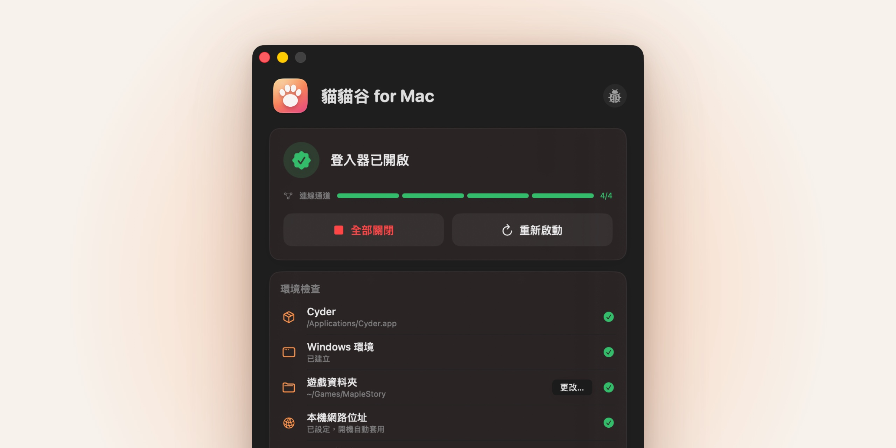

<picture>
  <source media="(prefers-color-scheme: dark)" srcset="docs/images/readme-hero-dark.jpg">
  
</picture>

---

[](https://github.com/xlanstar/mac-meow/releases/latest)

讓 Mac **不用虛擬機**，透過 [Cyder](https://github.com/dspp779/CyderBits)（Wine）運行 [貓貓谷](https://meowms.net)

原則：**不破解、不修改** 遊戲與登入器檔案，本專案只在 macOS／Wine 端補上與 Windows 的差異（本機網路位址、Wine 修正、Cyder 設定）。

## 系統需求

- Apple Silicon Mac，macOS 13 以上；需安裝 Rosetta 2（第一次執行 x86 程式時系統會提示）
- [Cyder](https://github.com/dspp779/CyderBits/releases)（已在 0.13.2、engine `CX26.3.0-W11-Cyder012` 測試）
- 楓之谷遊戲資料夾，依照[官方文件](https://meowms.net/guide.php)

## 安裝

1. **安裝 Cyder**：從 [Cyder Releases](https://github.com/dspp779/CyderBits/releases) 下載，把 `Cyder.app` 拖到「應用程式」。
2. **安裝 MacMeow**，以下擇一：
   - **Homebrew**（推薦）

     ```sh
      brew install --cask xlanstar/tap/macmeow
     ```

   - **手動下載**：從 [最新版 Release](https://github.com/xlanstar/mac-meow/releases/latest) 下載

3. 從「應用程式」開啟 `MacMeow.app`。App 經過 Apple 公證，第一次開啟時按「打開」即可。

## 使用方式

### 第一次開始遊戲

按「開始遊戲」後，App 會依序引導完成以下設定，之後就不需要再做：

1. **選擇遊戲資料夾**：選擇內含 `MapleStory.exe` 與貓貓谷登入器檔案的資料夾（放在 `~/Games/MapleStory` 會自動找到）。
2. **建立 Windows 環境**：沒用過 Cyder 時，App 會開啟 Cyder 讓它初始化，約 1–3 分鐘。
3. **設定本機網路位址**：輸入一次電腦密碼，加入連線需要的本機位址，並設定開機時自動套用。
4. **安裝與啟動**：套用 Wine 修補、安裝 VB6 執行環境（約 1–2 分鐘），再啟動認證器與登入器。

App 視窗的「環境檢查」清單會顯示每一項的狀態；某一步失敗時，可以按「查看詳細記錄」或「回報此問題」。

### 平常使用

開啟 `MacMeow.app`，按「開始遊戲」，等登入器出現後照平常方式登入。

- **關閉遊戲**：直接關閉遊戲即可，登入器、HostShield 等背景程式會在幾秒內自動關閉，其他 Cyder 遊戲不受影響。
- **全部關閉／重新啟動**：遊戲執行中可以在 App 按這兩個按鈕；會一併關閉 Cyder 內其他正在執行的遊戲。
- **叫出登入器**：遊戲執行時登入器會自動縮到最小，用選單「遊戲 → 顯示登入器」（⌘L）叫出來。
- **隱藏與結束 App**：按視窗左上角的關閉鈕只會隱藏視窗，App 仍在背景執行，可以從選單列的貓掌圖示叫回主視窗。要結束 App，請在貓掌圖示選「結束貓貓谷 for Mac」或按 ⌘Q。
- **遊戲設定**：在 App 首頁切換同步機制、圖形後端（預設 D3DMetal，需要安裝 CrossOver 或在 Cyder 設定安裝 GPTK，否則自動改用 DXMT；也可改選 DXMT）、FPS 上限（60、120、144 或不限制，預設不限制）、開啟「顯示效能 HUD」（在遊戲畫面顯示 FPS），或關閉「遊戲關閉時自動收尾」，下次「開始遊戲」時套用。
- **記錄檔**：在 `~/Library/Logs/MacMeow/launcher.log`，也可以在 App 內展開「詳細記錄」查看。

### 更新

App 會自動檢查新版本，有新版時主視窗頂端會出現提示；也可以從選單「貓貓谷 for Mac → 檢查更新⋯」手動檢查。

- **手動下載安裝的**：按「更新」，App 會自動下載、安裝並重新開啟，設定會保留；網路中斷時會等待並從中斷處繼續下載。
- **用 Homebrew 安裝的**：按「複製指令」，貼到「終端機」執行 `brew upgrade --cask macmeow`。

## 移除

- **手動下載安裝的**：在選單選「貓貓谷 for Mac → 解除安裝⋯」。
- **用 Homebrew 安裝的**：在「終端機」執行 `brew uninstall --cask macmeow`。舊版請先執行 `brew upgrade --cask macmeow` 更新，否則不會還原修補與設定。

兩種方式都會還原 Cyder engine 的修補與 Cyder 設定的原值、加回遊戲資料夾的下載隔離標記、移除本機網路位址與開機設定（需要密碼），並刪除 App 的設定與記錄。遊戲、Cyder 與其設定不會被刪除。

## 已知問題

原因和暫時解法見 [docs/known-issues.md](docs/known-issues.md)。

- **人多的地方很卡**：避開人多的頻道和地圖。
- **按住 Command 再按 A／Z／X／C／V 會變成 Ctrl**：按住 Command 時不要按這五個鍵。
- **「不正確的版本」**：把私服要求版本的 `MapleStory.exe` 放回遊戲資料夾。
- **macOS 28 以後可能無法執行**：在本專案確認相容之前，先不要升級。
- **出現「Intel 架構的 App 未來將無法執行」通知**：在 macOS 27 以前不影響遊戲，直接關閉即可。
- **Cyder 更新後無法啟動**：請回報 issue，或等待本專案更新。
- **手動刪除 App 後 `brew uninstall` 失敗**：先 `brew reinstall --cask macmeow`，再 `brew uninstall --cask macmeow`。

## 回報問題

遇到問題請 [建立 GitHub Issue](https://github.com/xlanstar/mac-meow/issues/new?template=bug_report.yml) 回報。

## 開發

本專案以 AI agent 開發。開發規範見 [AGENTS.md](AGENTS.md)，技術文件在 [docs/](docs/)。

## 授權

本專案腳本與工具為 MIT License；`patches/` 內的 Wine 修補與 DLL 為 LGPL-2.1-or-later。

> **免責聲明**：本專案與 Nexon、遊戲橘子、貓貓谷、Cyder 皆無關。私服的使用風險（帳號、合法性）請自行評估。專案不包含任何遊戲或登入器檔案。HostShield 每次啟動會下載並執行私服提供的遠端程式碼，這是原版行為，在 Windows 上也一樣。
